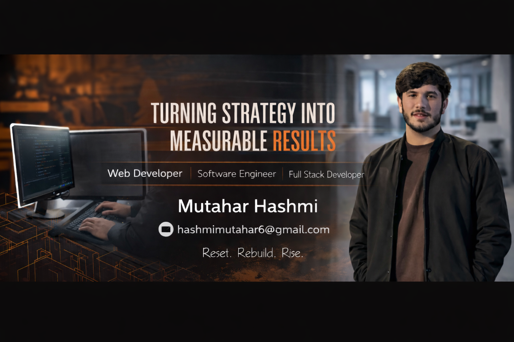

<h1 align="center">Hi 👋, I'm Mutahar Hashmi</h1>
<h3 align="center">AI Automation Engineer | Full Stack Developer | SaaS Builder</h3>

🚀 Building Smart Systems • 🤖 AI & Workflow Automation • 💻 Scalable Web Apps • ☁️ Cloud Architecture

  
  &nbsp;&nbsp;
  
  &nbsp;&nbsp;
  

---

## 🚀 About Me

I’m an **AI Automation Engineer & Full Stack Developer** focused on building scalable systems that help businesses automate, optimize, and grow.

💡 My expertise lies in combining:

- ⚙️ Backend Architecture & REST APIs  
- 🌐 Modern Frontend Applications  
- 🤖 AI Integrations & Workflow Automation  
- ☁️ Cloud Deployment & DevOps  

I don’t just write code — I build **smart, scalable solutions that solve real-world problems.**

---

## 🔥 What I’m Currently Building

- 🤖 AI Automation Systems (LLM workflows, chatbots, integrations)
- 🚀 SaaS Platforms (Full Stack Architecture)
- ☁️ AWS Infrastructure & System Design
- 📊 Productivity & Automation Tools for Businesses

---

## 🛠️ Tech Stack

### 💻 Programming
Java • Python • JavaScript • PHP • C • C++

### 🌐 Frontend
React • Next.js • HTML5 • CSS3 • Tailwind CSS • Bootstrap  

### ⚙️ Backend
Node.js • Express.js • Django • Spring Boot  

### 🗄️ Databases
MySQL • PostgreSQL • MongoDB • Redis  

### 🤖 AI & Automation
OpenAI APIs • LLM Integrations • Workflow Automation • Webhooks • n8n • Custom Automation Pipelines  

### ☁️ Cloud & DevOps
AWS • Docker • Linux • Git • Firebase  

---

## 📊 GitHub Analytics

  

  
  

---

## 🎯 Career Focus

Building intelligent systems where  
**AI Automation + Scalable Software + Cloud Infrastructure**  
come together to create real business impact.

---

## 🔗 Connect With Me

  
  &nbsp;&nbsp;
  
  &nbsp;&nbsp;
  
  &nbsp;&nbsp;
  

📧 Email: **hashmimutahar6@gmail.com**

---

⭐ Open to Full-Time | Freelance | AI Automation Projects | SaaS Collaboration
